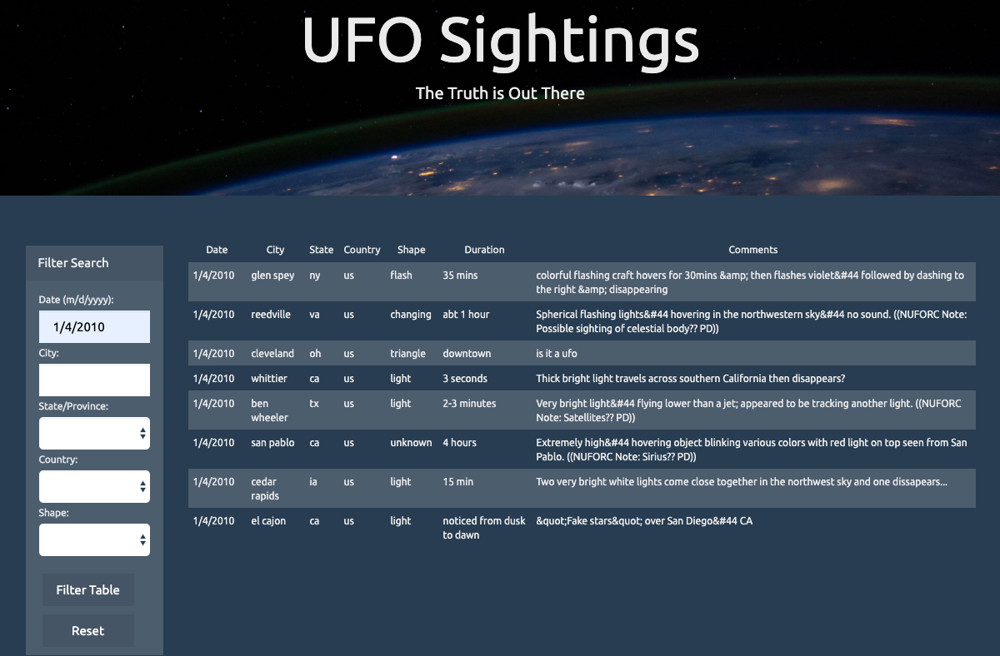

# javascript-challenge
In this challenge, I created a form using **JavaScript and D3** to filter UFO sightings ([UFO-level-2](UFO-level-2/)). The form is able to dynamically pull the dropdown elements from a data file ([data.js](UFO-level-2/static/js/data.js)) and format them. Then it handles multiple inputs to filter the results ([app.js](UFO-level-2/static/js/app.js)). I included several form validation techniques such as date formatting, checking for null values, and resetting the form. This project was a practice in Object-Oriented JS programming and event handling. 

### Live Website:
[https://ellemonke.github.io/javascript-challenge/UFO-level-2/](https://ellemonke.github.io/javascript-challenge/UFO-level-2/)

#### Screenshot:
